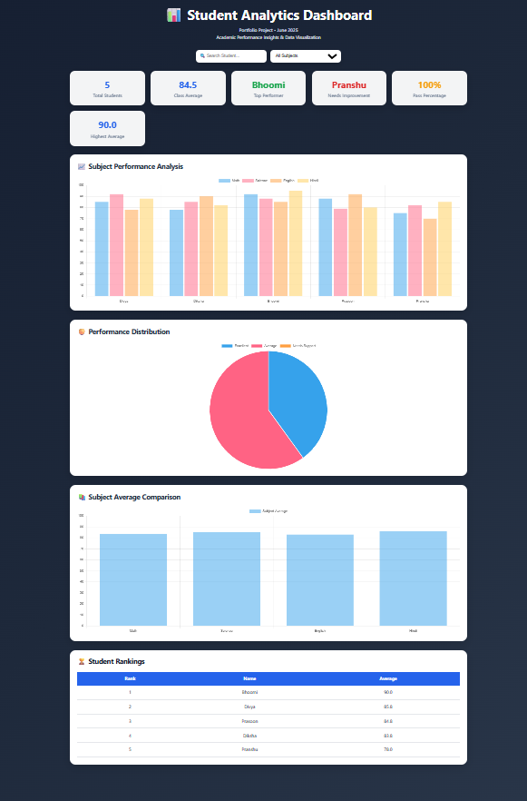

# 📊 Student Analytics Dashboard



A modern, data-driven academic performance dashboard built using **HTML, CSS, JavaScript, JSON, and Chart.js**. This project transforms raw student marks into meaningful insights through interactive visualizations, statistical analysis, and performance monitoring tools.

---

## 🚀 Live Demo

**Live Project:**
https://divyaprasoon-student-analytics.vercel.app/

**GitHub Repository:**
https://github.com/prasoon-develop/student-analytics-dashboard

---

## 📌 Project Overview

The Student Analytics Dashboard is designed to help educators and students understand academic performance through real-time analytics and interactive visualizations.

Instead of manually analyzing marks, the dashboard automatically processes student data, calculates performance metrics, generates rankings, identifies students requiring support, and visualizes academic trends using multiple chart types.

This project demonstrates practical skills in:

- Data Visualization
- DOM Manipulation
- JSON Data Processing
- Dashboard Development
- Frontend Engineering
- Performance Analytics

---

## ✨ Key Features

### 📈 Performance Analytics

- Class Average Calculation
- Student Ranking System
- Top Performer Identification
- Academic Risk Detection
- Pass Percentage Analysis
- Subject-wise Performance Evaluation

### 📊 Interactive Data Visualization

- Multi-Subject Bar Chart
- Performance Distribution Pie Chart
- Subject Average Comparison Chart
- Dynamic Data Rendering

### 🔍 Smart Dashboard Tools

- Real-Time Student Search
- Subject Filtering
- Ranking Table Generation
- Performance Monitoring
- Academic Support Alerts

### 🎨 User Experience

- Modern Dashboard Interface
- Responsive Design
- Professional UI Components
- Mobile-Friendly Layout
- Interactive Analytics Panels

---

## 🏗️ Project Architecture

```bash
student-analytics-dashboard
│
├── index.html
├── style.css
├── script.js
├── data.json
└── README.md
```

---

## 📚 Dataset Structure

The dashboard processes structured JSON data containing student performance records.

Example:

```json
{
  "id": 1,
  "name": "Divya",
  "math": 85,
  "science": 92,
  "english": 78,
  "hindi": 88
}
```

---

## 📊 Dashboard Metrics

The system automatically calculates:

- Total Students
- Class Average
- Top Performer
- Lowest Performer
- Pass Percentage
- Student Rankings
- Subject Averages
- Performance Categories

---

## 🛠️ Technology Stack

### Frontend

- HTML5
- CSS3
- JavaScript (ES6)

### Data Layer

- JSON

### Visualization

- Chart.js

### Deployment

- GitHub
- Vercel

---

## 🎯 Learning Outcomes

Through this project, the following concepts were implemented:

- Asynchronous JavaScript
- Fetch API
- JSON Data Handling
- DOM Manipulation
- Event Handling
- Data Visualization
- Responsive Web Design
- Dashboard Development
- Performance Analytics

---

## 📈 Future Enhancements

Planned improvements include:

- Export Reports as PDF
- Dark/Light Theme Toggle
- Advanced Student Insights
- Attendance Analytics
- CSV Upload Support
- Performance Forecasting
- Machine Learning-Based Predictions
- Multi-Class Dashboard Support

---

## ⚙️ Installation

Clone the repository:

```bash
git clone https://github.com/prasoon-develop/student-analytics-dashboard.git
```

Navigate to the project:

```bash
cd student-analytics-dashboard
```

Run locally:

```bash
Open index.html in a browser
```

---

## 📅 Project Timeline

**Project Type:** Portfolio Project

**Development Period:** June 2025

**Completion Date:** June 2025

This project was developed to strengthen practical skills in data visualization, frontend development, and analytics dashboard design.

---

## 👨‍💻 Author

**Divya Prasoon**

B.Tech Computer Science Engineering (Data Science)

Chandigarh University

---

## ⭐ Project Highlights

✔ Real-Time Analytics Dashboard
✔ Interactive Charts & Visualizations
✔ Performance Monitoring System
✔ Responsive Design
✔ JSON Data Processing
✔ Portfolio-Ready Project
✔ GitHub + Vercel Deployment
✔ Industry-Oriented Dashboard Architecture

---

### Transforming Academic Data into Actionable Insights 📊
